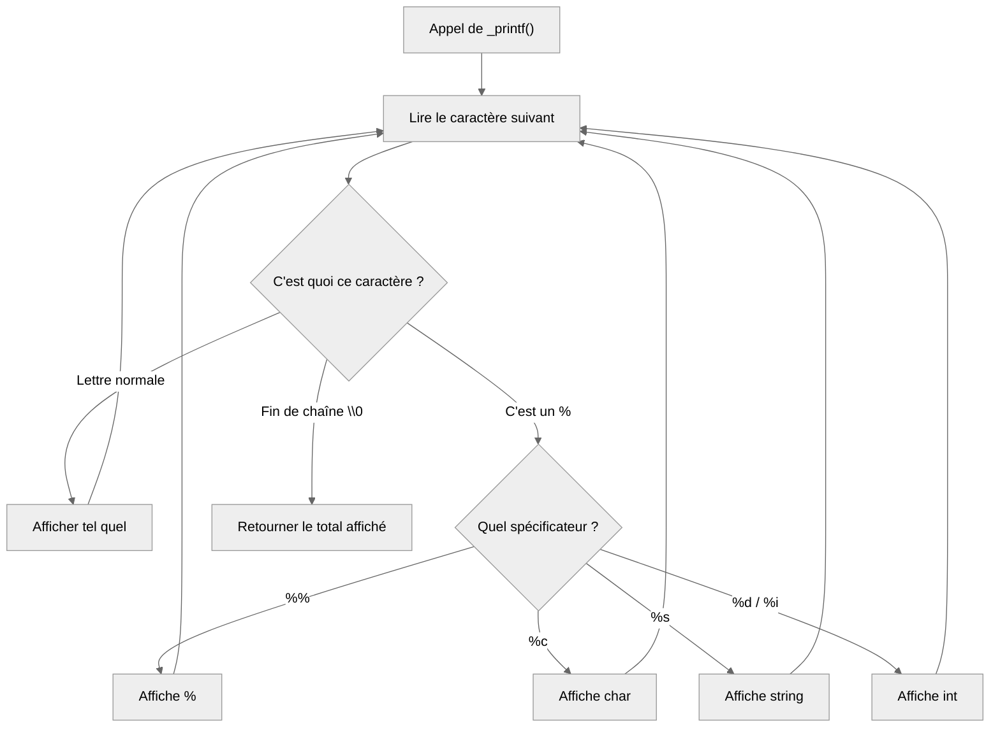

# _printf

Recréation de la fonction `printf` de la librairie standard C. Projet réalisé dans le cadre de la formation Holberton School.

## Compilation

```bash
gcc -Wall -Wextra -Werror -pedantic -std=gnu89 -Wno-format *.c
```

## Requirements

- Ubuntu 20.04 LTS
- GCC
- Git
- Style Betty

## Spécificateurs gérés

- `%c` — affiche un caractère
- `%s` — affiche une chaîne (affiche `(null)` si NULL)
- `%d` — affiche un entier décimal
- `%i` — affiche un entier (identique à %d)
- `%%` — affiche un `%` littéral

## Exemple

```c
#include "main.h"

int main(void)
{
    _printf("Hello %s\n", "world");
    _printf("Char: %c\n", 'A');
    _printf("Number: %d\n", 42);
    _printf("Negative: %i\n", -7);
    _printf("Percent: %%\n");
    return (0);
}
```

```
Hello world
Char: A
Number: 42
Negative: -7
Percent: %
```

## Man page

```bash
man ./man_3_printf
```

## Testing

```bash
gcc -Wall -Wextra -Werror -pedantic -std=gnu89 -Wno-format *.c -o printf_test
./printf_test
```

Vérifier les fuites mémoire :

```bash
valgrind --leak-check=full --track-origins=yes ./printf_test
```

## Flowchart

## Fichiers

- `_printf.c` — fonction principale
- `print_char.c` — gère `%c`
- `print_string.c` — gère `%s`
- `print_int.c` — gère `%d` et `%i`
- `main.h` — prototypes

## Auteur

[Soufiane FILALI](https://github.com/Souf-F) — Voir le fichier [AUTHORS](AUTHOR.txt) pour plus de détails.