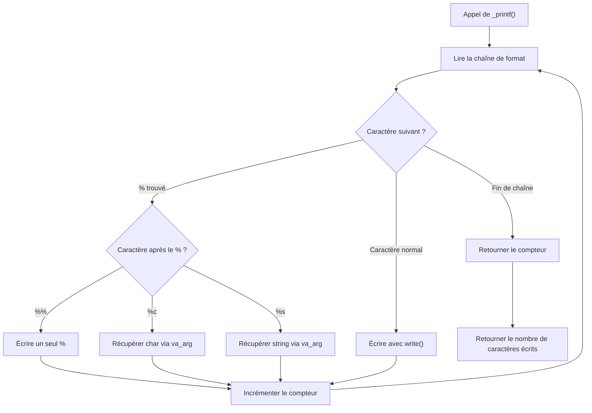

# _printf

Custom implementation of the C standard library `printf` function.

## Description

This project is a simplified version of `printf` that handles specific conversion specifiers. It was built as part of the Holberton School curriculum to deepen our understanding of variadic functions, string parsing, and formatted output in C.

The function writes output to `stdout` and returns the number of characters printed (excluding the null byte).

**Prototype:**

```c
int _printf(const char *format, ...);
```

## Supported conversion specifiers

| Specifier | Description | Example |
|-----------|-------------|---------|
| `%c` | Prints a single character | `_printf("%c", 'H')` → `H` |
| `%s` | Prints a string | `_printf("%s", "hello")` → `hello` |
| `%%` | Prints a literal `%` | `_printf("100%%")` → `100%` |

## Compilation

```bash
gcc -Wall -Werror -Wextra -pedantic -std=gnu89 -Wno-format *.c
```

## Usage

```c
#include "main.h"

int main(void)
{
    _printf("Character:[%c]\n", 'H');
    _printf("String:[%s]\n", "I am a string !");
    _printf("Percent:[%%]\n");

    int len = _printf("Hello %s\n", "world");
    _printf("Length: %d\n", len);
    return (0);
}
```

## Flowchart



## Files

| File | Description |
|------|-------------|
| `main.h` | Header file with function prototypes and include guards |
| `_printf.c` | Core function: parses the format string and dispatches to handlers |
| `functions.c` | Helper functions for each conversion specifier |

## Requirements

- Compiled on Ubuntu 20.04 LTS with `gcc`
- Code follows the Betty coding style
- No global variables
- No more than 5 functions per file
- Allowed functions: `write`, `malloc`, `free`, `va_start`, `va_end`, `va_copy`, `va_arg`

## Authors

- **Soufiane Filali**